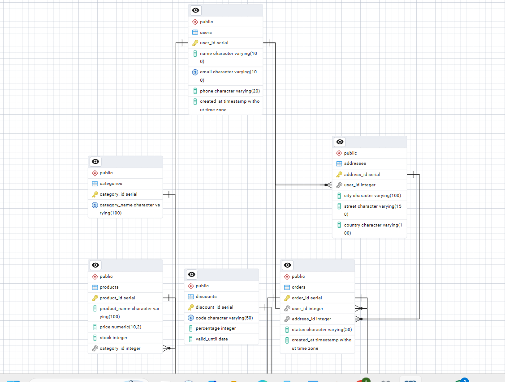
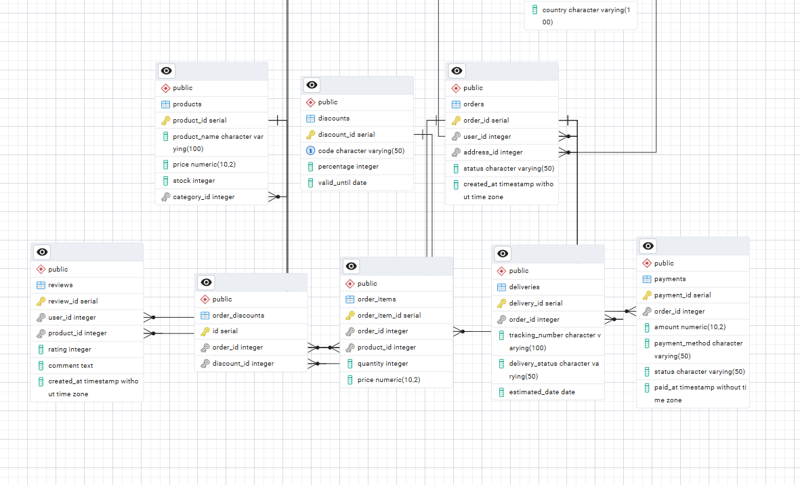

# Online Store Database Management System

## Project Overview

This project is a relational database system for an online store platform built with PostgreSQL. The database is designed to manage customers, products, orders, payments, deliveries, discounts, and product reviews in a structured and efficient way.

The system solves common problems faced by online stores:

* Organizing customer and product information
* Managing orders and deliveries
* Tracking payments and discounts
* Maintaining product reviews and ratings
* Ensuring data consistency with constraints and relationships

The project demonstrates the use of SQL schema design, relational modeling, constraints, joins, and analytical queries.

---

# Features

* Customer management
* Product catalog with categories
* Order and order item tracking
* Payment processing records
* Delivery management
* Discount system
* Product reviews and ratings
* Relational database design with constraints

---

# Database Design

## ER Diagram

### ERD Part 1

```markdown

```


---

### ERD Part 2

```markdown

```


---

## Database Schema

### Main Tables

| Table           | Description                         |
| --------------- | ----------------------------------- |
| users           | Stores customer information         |
| workers         | Stores employees and managers       |
| addresses       | Stores delivery addresses for users |
| categories      | Product categories                  |
| products        | Product information and stock       |
| orders          | Customer orders                     |
| order_items     | Products included in each order     |
| payments        | Payment records                     |
| deliveries      | Delivery tracking information       |
| reviews         | Customer product reviews            |
| discounts       | Discount and promo codes            |
| order_discounts | Connects discounts to orders        |

---

# Relationships

* One user can have multiple addresses
* One user can create multiple orders
* One order can contain multiple products
* Products belong to categories
* Orders can have payments and deliveries
* Users can leave reviews for products
* Discounts can be applied to orders

---

# Constraints Used

The project uses several SQL constraints to ensure data integrity:

* `PRIMARY KEY`
* `FOREIGN KEY`
* `UNIQUE`
* `CHECK`
* `NOT NULL`
* `ON DELETE CASCADE`
* `ON DELETE SET NULL`

Examples:

```sql
price DECIMAL(10,2) CHECK (price > 0)
```

```sql
rating INT CHECK (rating BETWEEN 1 AND 5)
```

```sql
email VARCHAR(100) UNIQUE NOT NULL
```

---

# Tech Stack

## Database

* PostgreSQL

## Tools

* pgAdmin 4
* SQL
* Git & GitHub

## Optional Backend Support

The database can be connected to:

* Python
* Java
* Node.js
* Django
* Spring Boot

---

# Project Structure

```text
project/
│
├── schema.sql
├── insert_data.sql
├── query.sql
└── README.md
```

---

# Setup Instructions

## 1. Clone the Repository

```bash
git clone https://github.com/Aliiaaaa/Database-final-project-.git
cd Database-final-project-
```

## 2. Create the Database

```sql
CREATE DATABASE online_store;
```

## 3. Run Schema File

Execute:

```bash
schema.sql
```

This creates all tables, constraints, and relationships.

## 4. Insert Sample Data

Execute:

```bash
insert_data.sql
```

This populates the database with sample users, products, orders, and other records.

## 5. Run Queries

Execute:

```bash
query.sql
```

This file contains analytical and relational queries.

---

# Table Descriptions

## users

Stores customer information.

| Column     | Description       |
| ---------- | ----------------- |
| user_id    | Unique user ID    |
| name       | Customer name     |
| email      | Customer email    |
| phone      | Phone number      |
| created_at | Registration date |

---

## workers

Stores employee information.

| Column    | Description      |
| --------- | ---------------- |
| worker_id | Unique worker ID |
| name      | Worker name      |
| role      | Employee role    |
| phone     | Contact number   |
| hired_at  | Hiring date      |

---

## products

Stores product information.

| Column       | Description       |
| ------------ | ----------------- |
| product_id   | Unique product ID |
| product_name | Product name      |
| price        | Product price     |
| stock        | Quantity in stock |
| category_id  | Product category  |

---

## orders

Stores customer orders.

| Column     | Description         |
| ---------- | ------------------- |
| order_id   | Unique order ID     |
| user_id    | Customer ID         |
| address_id | Delivery address    |
| status     | Order status        |
| created_at | Order creation time |

---

## order_items

Stores products inside orders.

| Column        | Description      |
| ------------- | ---------------- |
| order_item_id | Unique row ID    |
| order_id      | Related order    |
| product_id    | Ordered product  |
| quantity      | Product quantity |
| price         | Product price    |

---

## payments

Stores payment information.

| Column         | Description    |
| -------------- | -------------- |
| payment_id     | Payment ID     |
| order_id       | Related order  |
| amount         | Payment amount |
| payment_method | Card or cash   |
| status         | Payment status |

---

## deliveries

Stores delivery tracking data.

| Column          | Description       |
| --------------- | ----------------- |
| delivery_id     | Delivery ID       |
| order_id        | Related order     |
| tracking_number | Tracking code     |
| delivery_status | Delivery progress |
| estimated_date  | Expected delivery |

---

## reviews

Stores customer reviews.

| Column     | Description    |
| ---------- | -------------- |
| review_id  | Review ID      |
| user_id    | Customer ID    |
| product_id | Product ID     |
| rating     | Product rating |
| comment    | Review text    |

---

# Sample Queries

## 1. View All Users

```sql
SELECT * FROM users;
```

Purpose:
Displays all registered users.

---

## 2. View Orders with Customer Names

```sql
SELECT u.name, o.order_id, o.status
FROM users u
JOIN orders o
ON u.user_id = o.user_id;
```

Purpose:
Shows which customers created which orders.

---

## 3. Products with Categories

```sql
SELECT p.product_name, p.price, c.category_name
FROM products p
JOIN categories c
ON p.category_id = c.category_id;
```

Purpose:
Displays products together with their categories.

---

## 4. Count Orders by Status

```sql
SELECT status, COUNT(*) AS total_orders
FROM orders
GROUP BY status;
```

Purpose:
Analyzes order statuses such as pending, shipped, or completed.

---

## 5. Total Sold Products

```sql
SELECT p.product_name, SUM(oi.quantity) AS total_sold
FROM order_items oi
JOIN products p
ON oi.product_id = p.product_id
GROUP BY p.product_name;
```

Purpose:
Shows how many units of each product were sold.

---


# Future Improvements

* Add authentication system
* Add shopping cart functionality
* Implement inventory notifications
* Create REST API backend
* Add admin dashboard
* Add advanced analytics queries

---
Project Demo Video on YouTube


# Conclusion

This project demonstrates practical relational database development using PostgreSQL. It includes normalized tables, relationships, constraints, and SQL queries that simulate the functionality of a real-world e-commerce system.

The project is suitable for learning:

* Relational database design
* SQL joins and aggregations
* Data integrity constraints
* Database normalization
* PostgreSQL fundamentals

---

# Author

Developed as a Database Course Project.
